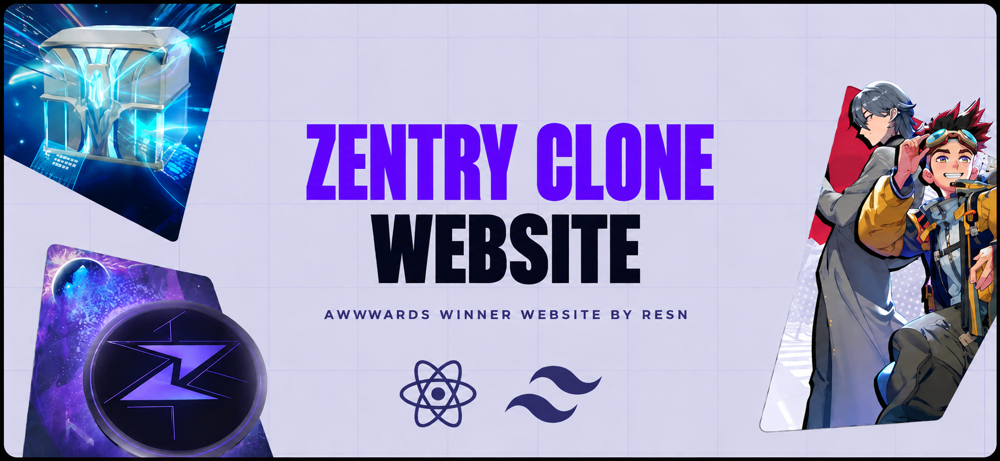

<!-- Main Image — Hero Section -->

  

<!-- Used Technologies -->

  
  
  
  
  

<!-- Project Name -->
<h3 align="center">ZENTRY Clone</h3>
 

<!-- Project Type -->

  

 

<!-- Project Overview & Desc.. -->
## 📝&nbsp; About **ZENTRY**
⇨ Rebuild of an **Awwwards-Winner** Gaming `Landing Page` designed to present a dynamic Web3 and AI-driven ecosystem through: Premium & Clean Design, strong focus on Performance & UX futhermore Top-Level Animations & Seamless Micro-Interactions.

◈ `Fully Responsive` → Ensures flawless Responsiveness across all devices and screen sizes.

◈ `Optimized Performance` → Built for fast loading and an optimized user experience.

◈ `Engaging Micro-Interactions` → Enhance the page with stunning Effects: Mouse Follow, Card 3D Tilt, ...

◈ `Top-Tier Scroll Animations` → This what make it an Awwwards-Winner! Clip-Path 3D Revealers, Pinned Content and Graphic-Based Complex Timelines.

◈ `Advanced 3D Clip-Path` → Using a special method makes static images looks like 3D Transformed Planes.

 

<!-- Real Showcase-->
## 🎬&nbsp; Demo & Showcase

  
<strong>Desktop</strong>

   

  

  
<strong>Tablet</strong>

   

  

  
<strong>Mobile</strong>

   

  

 

<!-- What Learn from that Project -->
## 🧠&nbsp; What I Learned 

① `Thing` → ...

② `Thing` → ...

③ `Thing` → ...

④ `Thing` → ...

---

### Start at => 05/09/2025
### End at => 10/09/2026
